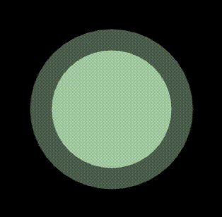

# SonarBeamer

Create Sonar effect for your [Phaser](http://phaser.io) games. Support for browserify included :)



## Install

You can clone this repo or use bower to install it:
```
bower install git://github.com/adibas03/SonarBeamer.git --save
```

Usage:
```javascript
// if you use browserify use the following, otherwise load it with your preferred method
var SonarBeamer = require('path/to/SonarBeamer');

// in create
var sonar= {};

//Add 2 graphics to be alternated between to an array or object
    for(var s=0;s<2;s++){
    var graphics = game.add.graphics(0, 0);
    graphics.beginFill(0xccffcc, 1);
    graphics.drawCircle(100, 100, 100);
    sonar[s] = graphics;
    }


var beamer = new SonarBeamer({
    game:this.game,
    graphicsArray: sonar,
    grow:300,
    loop:true,
    fade:true,
    onComplete: function() {...}
  });
  
  beamer.start();
```

This will display the sonar effect using the graphics passed and the onComplete() callback will be triggered once completed.

## Options
You can use the following options when initialising :

| Option | Description |
|--------|-------------|
| game| (required) a reference to the phaser.game object|
| graphicsArray| (required) a reference to the list of graphics or sprite to be used to create sonar effect|
| grow| (optional, default 200) this the percentage of the growth of the graphics. 100 means no growth|
| fade| (optional, default true) this indicates whether or not the graphics should fade out |
| loop| (optional, default true) this indicates whether or not the effect is fired once or looped |
| duration| (optional) the time to count|
| onComplete| (optional) a function to call when the time is up|


## Methods

| Method | Description |
|--------|-------------|
| start| resets the beamer and starts from the beginning.|
| stop| stops the beamer (note that `onComplete` will not be called when you call `stop`)|
| reset| resets the beamer|
| pause| pauses the beamer|
| resume| resumes the beamer after a pause|


## Flags

| Flag | Description |
|--------|-------------|
| hasFinished | boolean value showing if the indicator has finished counting or not |

